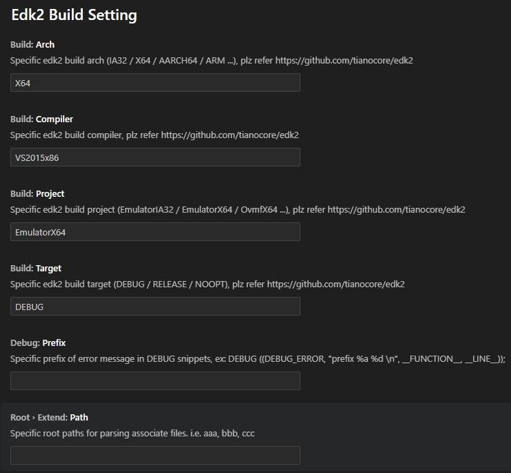

# edk2-vscode
edk2-vscode is a plugin of vscode for supporting edk2 files association.

## Syntax Highlight
* DEC/DSC/FDF/INF/UNI/VFR

## Definition Hotkey (F12)
Extension       |Functions
----------------|-------
**FDF**         |File definition hotkey
**DSC**         |File definition hotkey
**DEC**         |File definition hotkey
**INF**         |Function/File/Guid/Pcd definition hoteky
**VFR**         |STRING_TOKEN/Header definition hotkey


## Comment Toggling (Ctrl+/)
* DEC/DSC/FDF/INF/UNI/VFR

## Snippet
Name            |Alias
----------------|-------
**DEBUG**       |DEBUG / debug / Debug / CTRL+F1
**ERROR**       |EFI_ERROR / error
**NONE ERROR**  |!EFI_ERROR / !error
**ASSERT**      |ASSERT / assert


## Build
Functions       |How
----------------|-------
**Build dsc**   |Right click on dsc file in explorer/editor
**Go to build** |Right click on inf file in explorer/editor
**Settings**    |File > Preferences > Settings > Extensions > Edk2 Build Setting



```
GNU GENERAL PUBLIC LICENSE
Copyright (C) 2019-2021  WalonLi

This program is free software: you can redistribute it and/or modify
it under the terms of the GNU General Public License as published by
the Free Software Foundation, either version 3 of the License, or
(at your option) any later version.

This program is distributed in the hope that it will be useful,
but WITHOUT ANY WARRANTY; without even the implied warranty of
MERCHANTABILITY or FITNESS FOR A PARTICULAR PURPOSE.  See the
GNU General Public License for more details.

You should have received a copy of the GNU General Public License
along with this program.  If not, see <http://www.gnu.org/licenses/>.
```
